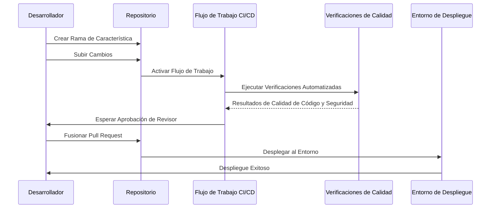

# Flujo de Trabajo DevOps con Entornos y Restricciones en GitHub

## Descripción General

Este repositorio implementa un flujo de trabajo DevOps optimizado aprovechando
los **Entornos de GitHub**, reglas de protección de ramas y herramientas de
automatización para la calidad del código. El objetivo es garantizar:

- Entornos para **develop**, **uat** y **production** con sus respectivos secretos.
- Un único archivo reutilizable de flujo de trabajo para GitHub Actions.
- Protección contra envíos directos a ramas críticas.
- Revisiones de calidad de código y seguridad utilizando herramientas como SonarQube y Snyk.
- Preparación para integrar pruebas automatizadas en el futuro.

---

## Entornos de GitHub

Al asociar secretos con los entornos, un único archivo de flujo de trabajo
puede manejar despliegues para todas las ramas, reduciendo redundancias y
errores potenciales.

## Reglas de Protección de Ramas

### Beneficios

- Garantiza que nadie pueda realizar envíos directos a ramas críticas.
- Obliga al uso de pull requests.
- Permite la integración de herramientas automatizadas como:
  - **SonarQube**: Para revisiones de calidad de código.
  - **Snyk**: Para el análisis de vulnerabilidades en dependencias y contenedores.

## Revisiones de Calidad y Seguridad

### Proceso de Revisión de Código

1. Cuando un desarrollador crea un pull request:
   - Ejecutar SonarQube para el análisis de calidad de código.
   - Ejecutar Snyk para analizar vulnerabilidades.

2. El pull request no puede ser fusionado hasta que:
   - Todas las verificaciones automatizadas hayan pasado.
   - La revisión manual del código sea aprobada por los revisores designados.

## Integración Futura: Pruebas Automatizadas

Este flujo de trabajo está diseñado para integrar fácilmente pruebas
automatizadas en el futuro. Agrega pasos de prueba (por ejemplo, pruebas
unitarias o de integración) al pipeline de CI/CD antes del despliegue.

---

## Diagrama del Flujo de Trabajo DevOps

## Resumen

Este configuración asegura un flujo de trabajo DevOps robusto y escalable con:

- Secretos específicos por entorno.
- Protección para ramas críticas.
- Automatización en revisiones de calidad y seguridad.
- Preparación para futuras mejoras con pruebas automatizadas.
